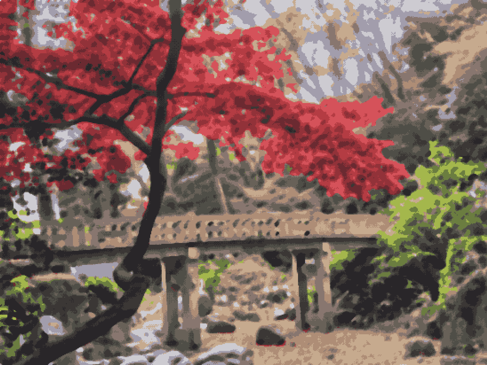
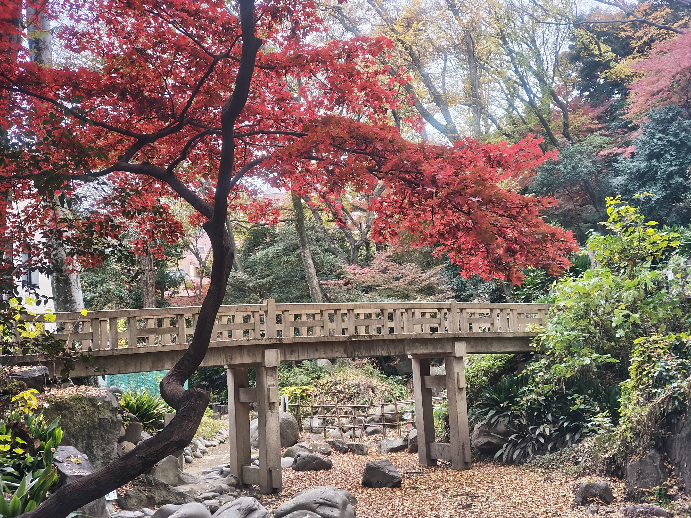

# PixelArt Converter

Language: [English](README.md)

画像をアップロードするだけで、細かくカスタマイズ可能なピクセルアートに変換できる Web アプリです。  

- Demo: https://pixelart.streamlit.app
- Python: 3.12
- License: Apache-2.0


## 特徴

- パレット生成
  入力画像に合わせたパレットを自動生成（色数・反復回数を調整可能）
- カスタムパレット  
  HEX カラーコードを入力して任意パレットを作成
- フィルタと画質調整  
  Pixel DoG, Morphology, Kuwahara, Median, Scratch, 彩度/明るさ/コントラスト/シャープネス
- ディザリング  
  Floyd-Steinberg / Ordered / Atkinson
- 後処理オプション  
  Delete transparent color, Delete Alpha Channel, Enable Grid, No Expand Image, No Color Convert, decrease Color

## スクリーンショット
| 変換後 | 元画像 |
| --- | --- |
|  |  |

## セットアップ

```bash
nix develop
uv run streamlit run main.py
```

または、ワンショット実行:

```bash
nix run .
```


## 使い方

1. 画像をアップロード
2. ピクセル化方式を選択
3. カラーパレットを選択
4. 必要に応じてフィルタやディザリングを調整
5. 変換結果を保存して利用


## ライセンス

Apache License 2.0。詳細は `LICENSE` を参照してください。
