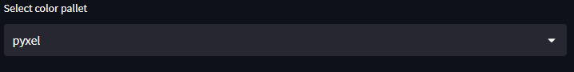
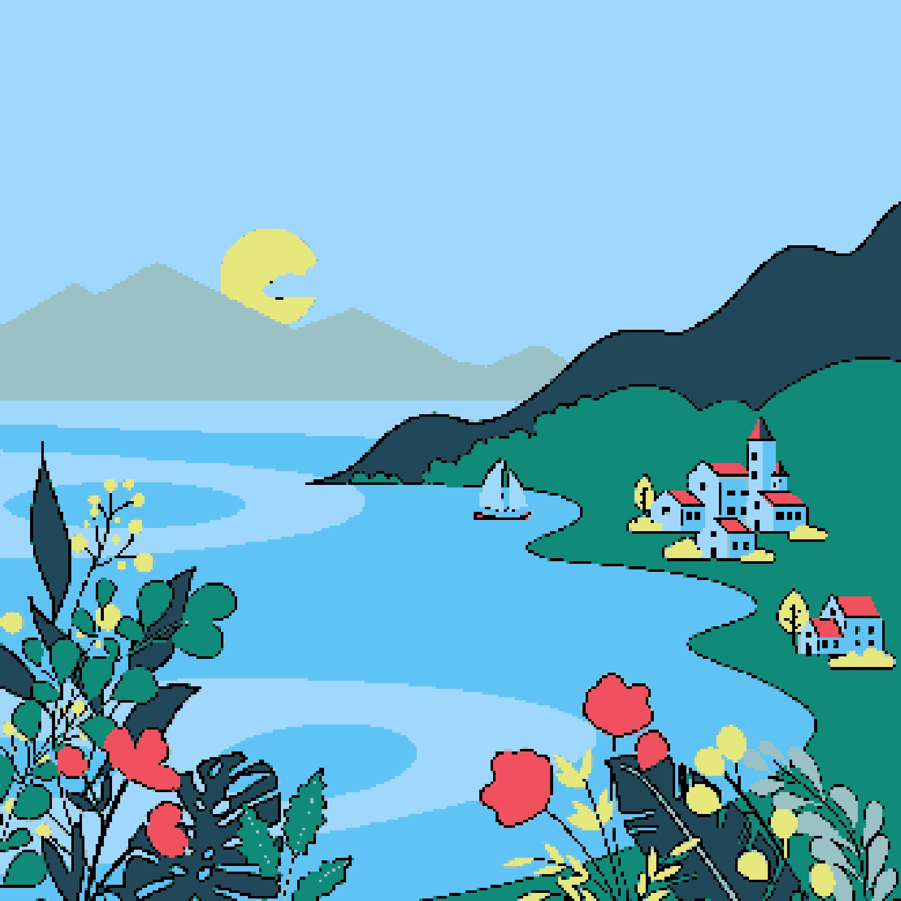
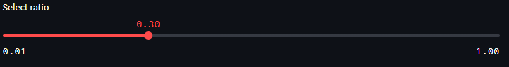
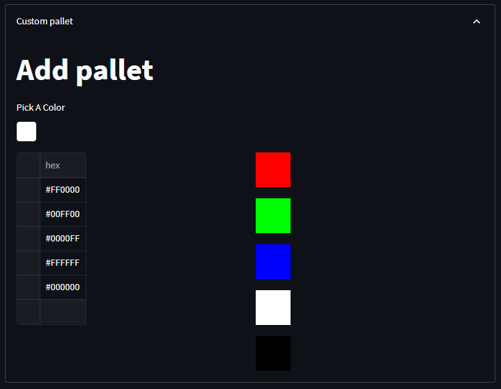
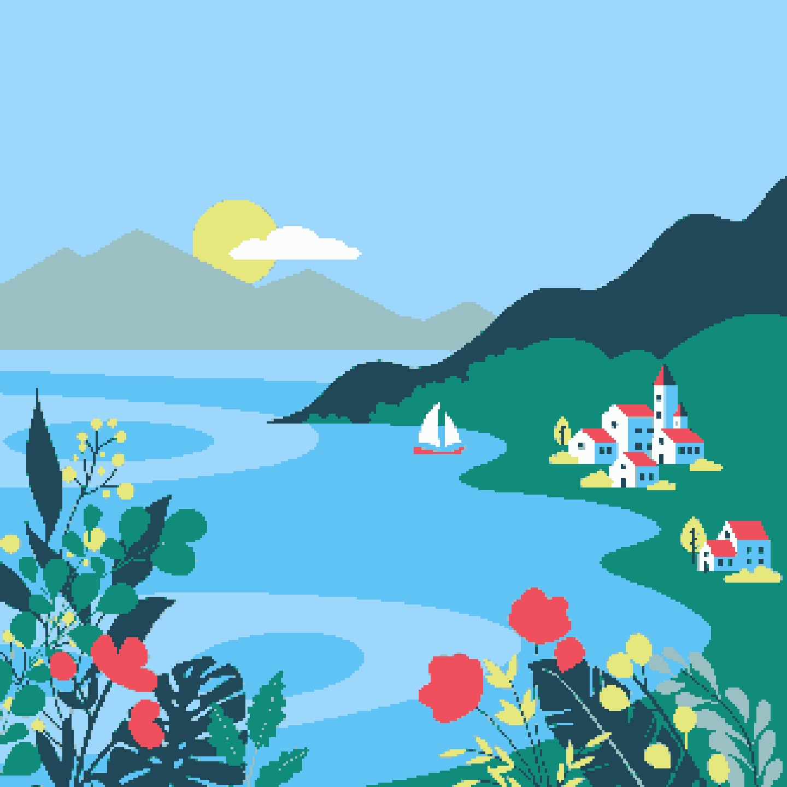
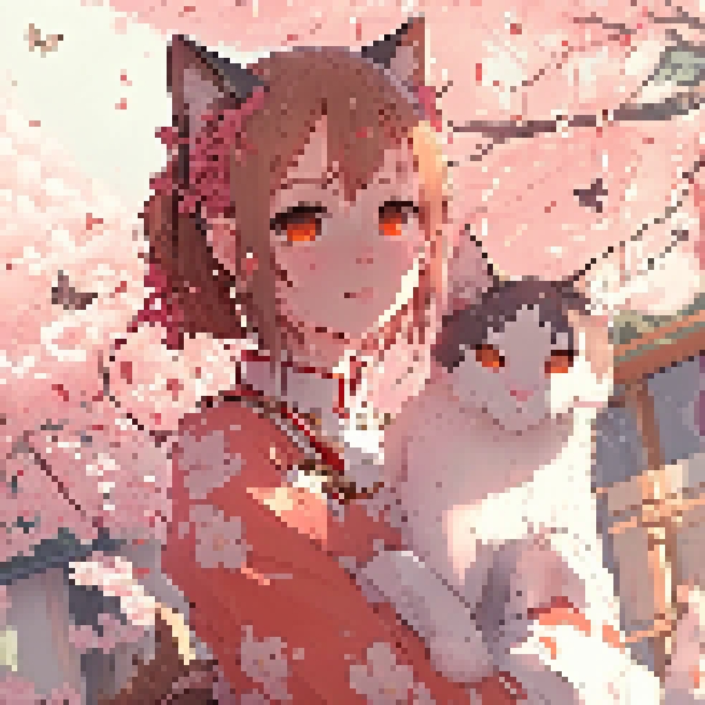
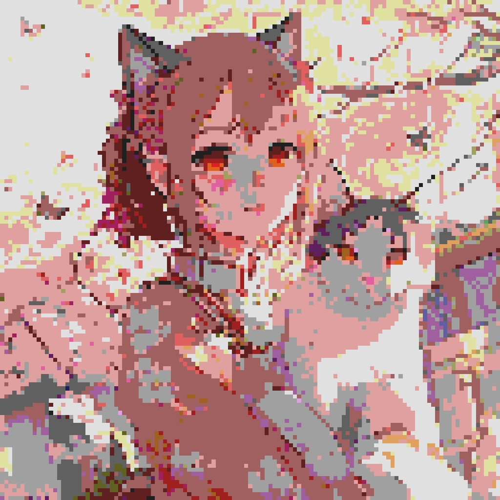
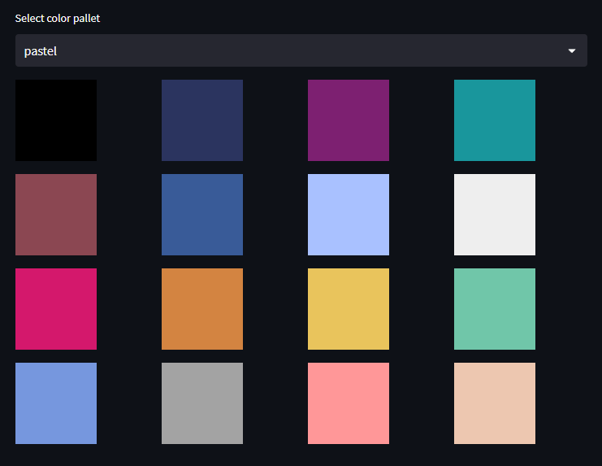

# PixelArt-Converter
Language : [English](README.md)  
# 基本機能
## color palette
このサイトでは、色を変換しています。  
色を変換するときに使用するカラーパレットを選択します。  
Pyxelは[Pyxel](https://github.com/kitao/pyxel)というゲームライブラリで使用されている色です。  

### AI Palette
KMeansを使用して入力された画像専用のパレットを作成します。  
https://pixabay.com/vectors/homes-the-needle-village-mountains-8194751/

## Mosaic ratio
0.01ずつ調整できるスライダーで、数字が少なくなるほどドットが大きくなります。

## Custom palette
Colorpaletteを自分で作成できます。  
表の中にパレットに追加したい色をカラーコードで入力します。  
表に入力した色は右側に表示されます。  
表の上にあるカラーピッカーから色を選択してカラーコードをコピーし、入力すると楽です。  
※スポイトには対応していません

## Tweet
ツイッターにツイートするボタンです。  
画像の添付には対応していません。  
※画像を添付する際、画像のコピーまたは画像をダウンロードして添付してください  
※トラッカーブロックをオフにしないと表示されない可能性があります。  

# More Options
## Anime Filter
エッジを追加します。  
アニメっぽくなるかもしれないです。

### threhsold
AnimeFilter(エッジ処理)の値です。  
値が小さいほどエッジが多くなります。  
#### threhsold 1
エッジの量を指定します。
#### threhsold 2
エッジの長さを指定します。

## No Color Convert
カラーパレットを使用しないようにします。  

## decrease Color
減色処理をします。  
基本的には、``No Color Convert``と同時に使用します。

# Experimental Features
まだ正式な機能ではないので、バグや、エラーが発生する可能性があります。  
## AI
### AI Color
AIカラーパレットを使用しているときに使う色の数を変更します。

# Color Sample
デフォルトのカラーパレットに含まれている色を表示します  

